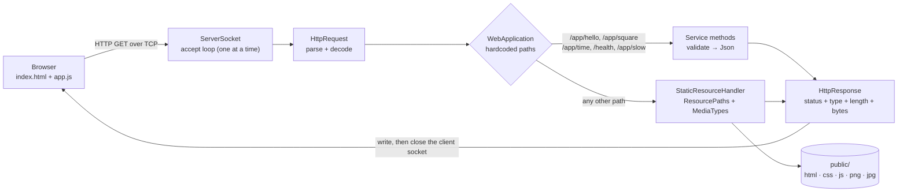
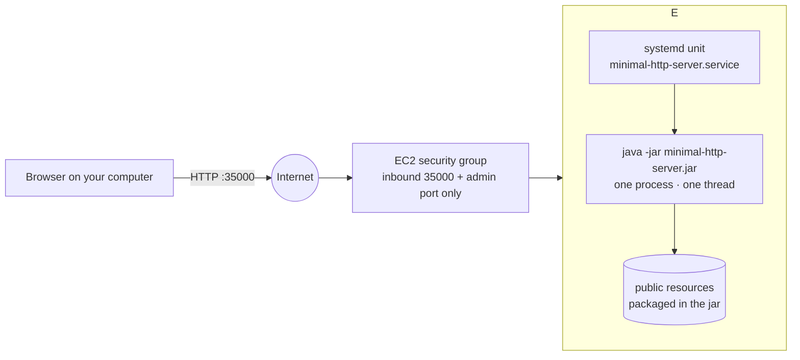
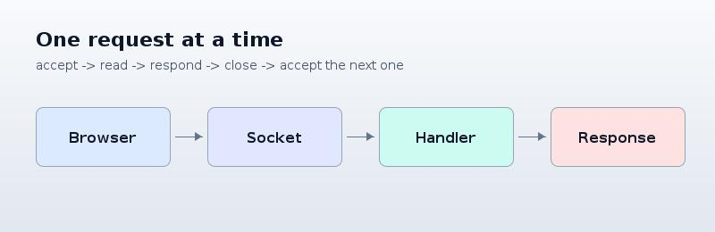

# From a Minimal HTTP Server to a Web Application on AWS

A small web application built on top of a **socket based, deliberately sequential Java HTTP
server**. The same process serves an HTML page, a style sheet, a JavaScript client and two images,
answers four hardcoded service URLs with JSON, and runs unchanged on a single AWS EC2 instance.


## What problem it addresses

Scalability starts with understanding the baseline. Before distributing work across machines it is
necessary to see what *one* server actually does: how many requests a single page view produces,
where requests wait, and which assumptions make future distribution possible.

This laboratory therefore keeps a limitation on purpose. The server accepts one connection at a
time and there is no thread, no executor and no queue anywhere in the code. Everything else — a
correct HTTP exchange, several resource types, stateless services, remote deployment — is
implemented properly, so that the cost of the missing concurrency can be measured instead of
guessed. Concurrency and load balancing belong to the next architectural step, after the behaviour
of this baseline is clear.

**Scope of this laboratory**

| In scope | Out of scope |
| --- | --- |
| Correct HTTP request parsing and responses | Threads, thread pools, queues |
| HTML, CSS, JavaScript, PNG and JPEG resources | Load balancers, autoscaling, containers |
| Four hardcoded services returning JSON | Databases, sessions, authentication |
| An asynchronous browser client | Frameworks, routers, dependency injection |
| Deployment on one EC2 instance | Production grade security and TLS |

---

## System metaphor and architecture

> **The application is a reception desk with a single receptionist.**

- Behind the desk there is a **shelf of printed documents** ready to be handed over: the page, the
  style sheet, the script and the two images. The receptionist does not write them, only finds
  them, checks that the visitor is allowed to ask for them, and hands over the right one.
- On the desk there are **four printed forms** the receptionist can fill in by hand: a greeting, a
  square, the current time and a health note. Each one is a different form, chosen by name, not by
  a general procedure.
- A **visitor** (the browser) arrives with one question at a time, and after receiving an answer
  usually discovers that it needs to ask again: the page mentions a script and two images, so four
  more questions follow.
- The visitor can **do something else while waiting** (the asynchronous JavaScript client), but
  there is still only one receptionist: a second visitor waits in the queue until the first one is
  finished, however patient or busy they are.
- Moving the desk to another building (EC2) changes the **address and the door policy** (the
  security group), not the number of receptionists.

The metaphor maps directly onto the components:

| Metaphor | Component | Responsibility |
| --- | --- | --- |
| Visitor | Browser + `app.js` | Renders the page, sends asynchronous requests, updates only the result area |
| The queue at the desk | TCP accept backlog | Holds connections while the single receptionist is busy |
| Receptionist | `HttpServer` | Accepts one connection, reads one request, writes one response, closes, repeats |
| Understanding the question | `HttpRequest` | Parses the request line, the headers and the decoded query string |
| Writing the answer | `HttpResponse` | Status line, headers, blank line and a body that is always bytes |
| Choosing the form or the document | `WebApplication` | Five explicit conditions, then fall through to the shelf |
| The shelf and its rules | `StaticResourceHandler`, `ResourcePaths`, `MediaTypes` | Finds the file, refuses unsafe paths, describes the content type |
| Filling in a form safely | `Json` | Escapes every value that came from the visitor |
| The building and its door | EC2 instance + security group | Host and network boundary, not architecture |

### Request flow



### Deployment view



One page view of this application produces five requests, and the server completes each one before
starting the next:



---

## Design decisions

**The server stays sequential.** The accept loop runs on the calling thread and handles each
connection completely before accepting the next one. This is the object of study: it makes the
waiting behaviour measurable (see [the evidence](docs/evidence.md#6-the-sequential-limitation-section-62))
and it is the limitation that the next laboratory removes. The only concession is a read timeout
of three seconds, because browsers routinely pre-open sockets they never use and a single idle
socket would otherwise block the whole loop.

**The routes are hardcoded on purpose.** `WebApplication` compares the path against five string
constants. A router, an annotation scanner or a dependency injection container would hide exactly
the mechanism the laboratory has to expose: a path selects behaviour. What a framework would later
generalise is visible here as five `if` statements.

**Content types are chosen by extension, and unknown extensions are not published.** The content
type is the only thing that tells the browser whether bytes are a document, a script or an image.
`MediaTypes` holds that association in one place; a file whose extension is not in the table is
treated as if it did not exist, so the server never publishes something it cannot describe
correctly.

**Every resource is read as bytes.** Text and binary resources share one response path, and
`Content-Length` is always the real number of bytes. Reading an image as a string would corrupt it,
and counting characters instead of bytes would truncate any accented text.

**Unsafe paths are rejected, not repaired.** The request path is percent-decoded first and
normalised afterwards, which is the only order that catches `%2e%2e`. A segment `..` makes the
request fail with `403` instead of being resolved, because nothing above the public area is
publishable. When an external resources directory is configured, the resolved file is additionally
required to stay inside it.

**Untrusted values are escaped where they are written.** `Json` escapes quotes, backslashes,
control characters and `< > &`, so a name such as `<script>` can never become active content in a
response. The HTML error pages escape the echoed path in the same way.

**The client is asynchronous, and that is not the same as a concurrent server.** `fetch` keeps the
browser responsive and updates only the result area, so the page never reloads. It does not give
the Java process a second execution path — the second request still waits.

**Services are stateless.** Nothing is stored between requests, which is what would later allow a
second instance to answer exactly like the first one.

---

## Project structure

```text
.
├── pom.xml                                  Maven build (Java 17, JUnit 5, executable jar)
├── mvnw, mvnw.cmd, .mvn/                    Maven wrapper: builds with only a JDK installed
├── README.md
├── docs/
│   ├── aws-deployment.md                    step by step EC2 procedure and mandatory cleanup
│   ├── evidence.md                          screenshots, protocol traces and measurements
│   ├── reflection.md                        answers to the eight discussion questions
│   └── img/                                 screenshots and the captured network log
├── scripts/
│   ├── deploy-to-ec2.sh                     build + upload + install, from your computer
│   ├── install-on-instance.sh               runs on the instance: runtime, artifact, service
│   ├── minimal-http-server.service           systemd unit template
│   ├── smoke-test.sh                        functional matrix against any running instance
│   └── observe-sequential-limitation.sh     reproduces the waiting behaviour of section 6.2
└── src/
    ├── main/
    │   ├── java/edu/escuelaing/tdse/httpserver/
    │   │   ├── Main.java                    entry point: configuration and wiring
    │   │   ├── ServerConfig.java            port and resources directory, arguments or environment
    │   │   ├── HttpServer.java              sequential accept loop
    │   │   ├── HttpRequest.java             request line, headers, decoded query string
    │   │   ├── HttpResponse.java            status, headers and a body that is always bytes
    │   │   ├── RequestHandler.java          contract between transport and content
    │   │   ├── WebApplication.java          the five hardcoded paths
    │   │   ├── StaticResourceHandler.java   the public resources area
    │   │   ├── ResourcePaths.java           path normalisation and traversal refusal
    │   │   ├── MediaTypes.java              extension to content type
    │   │   ├── Json.java                    JSON writing and escaping
    │   │   ├── Responses.java               shared 403/404/405 pages
    │   │   └── MalformedRequestException.java
    │   └── resources/public/                the public resources area, packaged in the jar
    │       ├── index.html                   home page and client interface
    │       ├── styles.css
    │       ├── app.js                       asynchronous client
    │       └── images/                      logo.png, request-flow.jpg, favicon.png
    └── test/java/edu/escuelaing/tdse/httpserver/
        ├── HttpRequestTest.java             parsing, decoding and malformed input
        ├── ResourcePathsTest.java           index resolution and path traversal
        ├── MediaTypesTest.java              content type association
        ├── JsonTest.java                    escaping of untrusted values
        ├── ServerConfigTest.java            port and directory configuration
        ├── WebApplicationTest.java          each service, valid and invalid input
        └── HttpServerIntegrationTest.java   the whole exchange over real sockets
```

Tests live in `src/test/java`, completely separated from the application source. Public resources
live in `src/main/resources/public`, so they are packaged inside the jar and the deployable
artifact is a single file.

---

## Prerequisites

| Tool | Version | Notes |
| --- | --- | --- |
| JDK | 17 or newer | the build targets Java 17; developed and tested with OpenJDK 21 |
| Apache Maven | 3.8 or newer, optional | only if you prefer it over the bundled wrapper |
| Git | any recent version | to clone the repository |
| curl | optional | used by `scripts/smoke-test.sh` |
| A modern browser | optional | Chrome, Firefox or Edge, for the client and its network view |

No other dependency is needed: the application has **no runtime dependencies**, and JUnit 5 is used
only for the tests.

---

## Installation and build

```bash
git clone https://github.com/SoullessSapo/Minimal-HTTP-Server-to-a-Web-Application-on-AWS.git
cd Minimal-HTTP-Server-to-a-Web-Application-on-AWS

./mvnw -B clean package     # Linux and macOS
.\mvnw.cmd -B clean package  # Windows PowerShell
```

The Maven wrapper downloads the exact Maven version this project was built with, so a local Maven
installation is not required — only a JDK. If you already have Maven, `mvn -B clean package` does
the same thing.

The build produces the deployable artifact `target/minimal-http-server.jar`, which already contains
the HTML page, the style sheet, the client script and the images.

---

## How to run locally

```bash
java -jar target/minimal-http-server.jar                 # default port 35000
java -jar target/minimal-http-server.jar --port 8080     # another port
PORT=8080 java -jar target/minimal-http-server.jar       # the same, from the environment
```

Then open <http://localhost:35000/>.

| Option | Environment variable | Default | Meaning |
| --- | --- | --- | --- |
| `-p`, `--port <number>` | `PORT` | `35000` | port the server listens on |
| `-s`, `--static-dir <path>` | `STATIC_DIR` | *(none)* | directory whose files override the packaged resources, useful to edit the page on the instance without rebuilding |

Stop the server with `Ctrl+C`. The shutdown hook closes the listening socket, so the port is
released immediately and the server can be started again straight away.

Running it from Maven without packaging:

```bash
mvn -q compile exec:java -Dexec.mainClass=edu.escuelaing.tdse.httpserver.Main
```

---

## How to use the application

The home page is the client interface. Every action is sent with `fetch`, so the page never
reloads: only the result area or the error area changes.

| Action on the page | Request | Success | Failure |
| --- | --- | --- | --- |
| Type a name, *Ask for a greeting* | `GET /app/hello?name=Ana` | `200` `{"service":"greeting","name":"Ana","greeting":"Hello, Ana!"}` | empty or longer than 60 characters → `400` `{"error":"..."}` |
| Type a number, *Calculate the square* | `GET /app/square?value=7` | `200` `{"service":"square","input":7,"square":49}` | not a number, or a result out of range → `400` |
| *Ask for the server time* | `GET /app/time` | `200` `{"service":"time","serverTime":"2026-09-07 23:06:04","zone":"Etc/UTC","epochMillis":...}` | — |
| *Check health* | `GET /health` | `200` `{"status":"ok","uptimeSeconds":42}` | — |
| *Start a slow request* | `GET /app/slow?seconds=8` | `200` after the requested delay, capped at 20 seconds | non numeric input → `400` |

Static resources: `/` (the page), `/styles.css`, `/app.js`, `/images/logo.png`,
`/images/request-flow.jpg`, `/images/favicon.png`.

Error behaviour of the server as a whole:

| Situation | Status | Body |
| --- | --- | --- |
| Missing parameter, invalid number | `400` | JSON with an `error` member |
| Malformed request line | `400` | plain text |
| Missing file, unknown extension, unknown service path | `404` | HTML page |
| Path that tries to leave the public area | `403` | HTML page, nothing disclosed |
| Any method other than `GET` | `405` | HTML page and an `Allow: GET` header |

In the browser, an invalid input is reported as a readable message, a rejected request shows its
HTTP status, and a server that cannot be reached is reported separately as a network failure.

---

## How to run the tests

**Automated suite** — 56 tests, unit and integration, no server has to be running:

```bash
./mvnw test        # or mvn test, or .\mvnw.cmd test on Windows
```

The integration tests start the server on an ephemeral port over real sockets and check status
codes, content types, byte-exact images, path traversal, malformed requests and ten consecutive
requests in one server run.

**Manual validation** — with the server running:

```bash
./scripts/smoke-test.sh                             # local
./scripts/smoke-test.sh http://<public-dns>:35000   # against EC2
```

**Observing the sequential limitation** (section 6.2):

```bash
./scripts/observe-sequential-limitation.sh http://localhost:35000 6
```

Or, in the browser: open the page in two windows, start a slow request in the first one and
immediately ask for the server time in the second one.

---

## AWS deployment

The full procedure — preparing the artifact, launching the instance, the security group rules,
installing the runtime, registering the systemd service, verifying from inside and from outside the
instance, and the **mandatory cleanup** — is documented in
**[docs/aws-deployment.md](docs/aws-deployment.md)**.

Summary:

```bash
export EC2_HOST=ec2-user@<public-dns>
export EC2_KEY=~/.ssh/your-lab-key.pem      # never stored in this repository
./scripts/deploy-to-ec2.sh                  # build, upload, install and start the service
curl -i http://<public-dns>:35000/health
```

The application runs as the systemd service `minimal-http-server`: it starts on its own, writes to
the journal, stops cleanly and keeps running after the administration session is closed. Only the
application port and the approved administration port are opened in the security group. No public
address, key or credential is stored in this repository.

---

## Evidence and results

Screenshots of the running application, the browser network view, the protocol traces of every
response type, the controlled errors and the measurement of the sequential limitation are collected
in **[docs/evidence.md](docs/evidence.md)**.

The reflection — the answers to the eight discussion questions — is in
**[docs/reflection.md](docs/reflection.md)**.

---

## Known limitations

- **The server is sequential.** One connection is served at a time. A slow request delays every
  other request, and the single accept loop is also a single point of failure.
- **Only `GET` is implemented.** `POST`, `PUT`, `DELETE` and `HEAD` are answered with `405`.
- **Only a small set of hardcoded paths exists.** There is no router, no path parameters and no
  content negotiation; adding a service means adding a condition.
- **One request per connection.** Every response closes the socket (`Connection: close`); keep
  alive, chunked transfer encoding and compression are not implemented.
- **No request body is read**, so uploads and form posts are not supported.
- **No TLS, no authentication, no sessions, no persistence.** Nothing is stored between requests.
- **A read timeout of three seconds** protects the loop from idle connections, which also means a
  very slow client can have its connection dropped.
- **This is not a production ready HTTP server.** It is a teaching baseline whose limitations are
  deliberate and measured.

---

## Author and acknowledgment

**Esteban Valencia** — Networking Lab, Part 2 (TDSE, 2026-2), Escuela Colombiana de Ingeniería
Julio Garavito.

Acknowledgments and references used:

- The course laboratory guide *From a Minimal HTTP Server to a Web Application on AWS*, which
  defines the scope, the required behaviour and the assessment criteria.
- [RFC 9110, HTTP Semantics](https://www.rfc-editor.org/rfc/rfc9110.html) and
  [RFC 9112, HTTP/1.1](https://www.rfc-editor.org/rfc/rfc9112.html) for status codes, methods and
  message format.
- [MDN Web Docs](https://developer.mozilla.org/) for `fetch`, the Web API used by the client, and
  for MIME types.
- The [Java SE 17 API documentation](https://docs.oracle.com/en/java/javase/17/docs/api/) for
  `java.net.ServerSocket`, `java.net.URLDecoder` and `java.nio.file`.
- The official AWS documentation listed at the end of
  [docs/aws-deployment.md](docs/aws-deployment.md).
- The build uses [Apache Maven](https://maven.apache.org/) and [JUnit 5](https://junit.org/junit5/);
  the application itself has no runtime dependency.
- Development assistance: the code, tests and documentation of this repository were written by the
  author with the help of Claude Code, and every behaviour described here was executed and verified
  locally.
