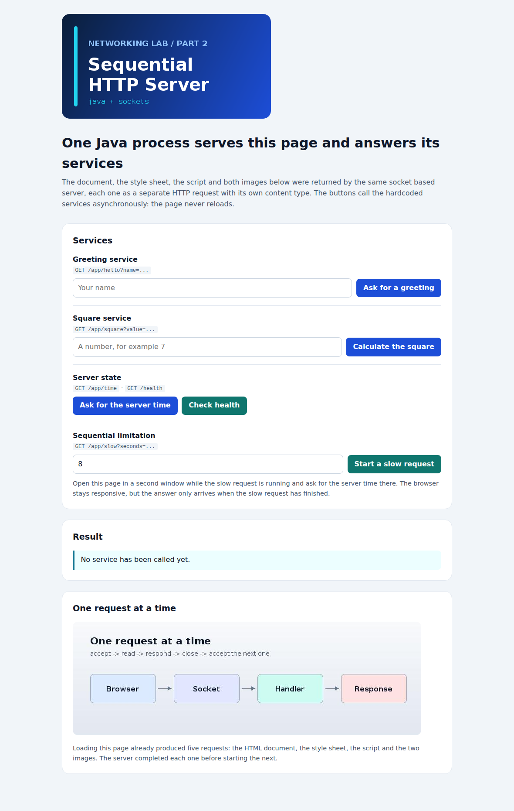
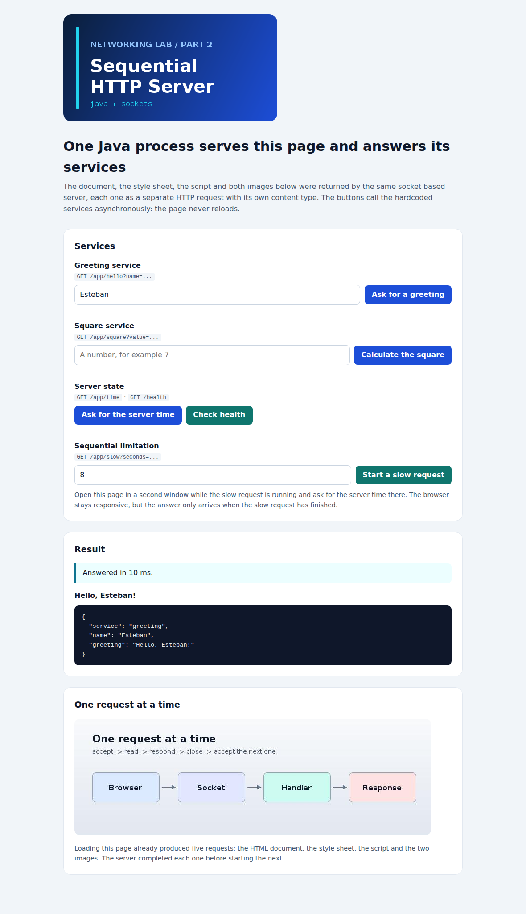
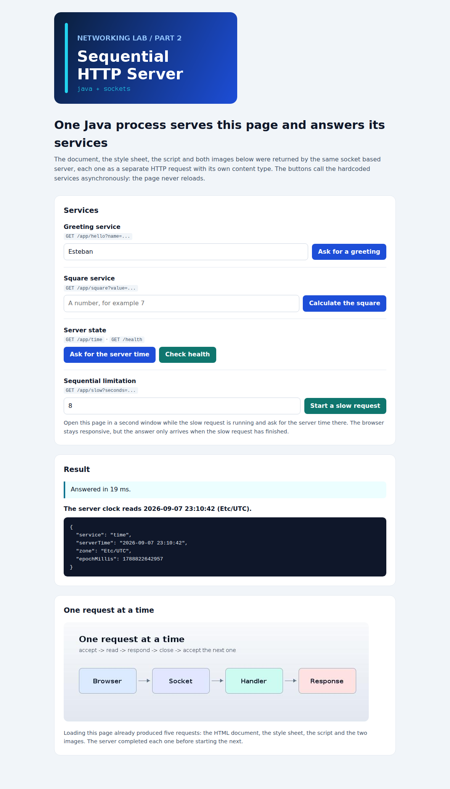
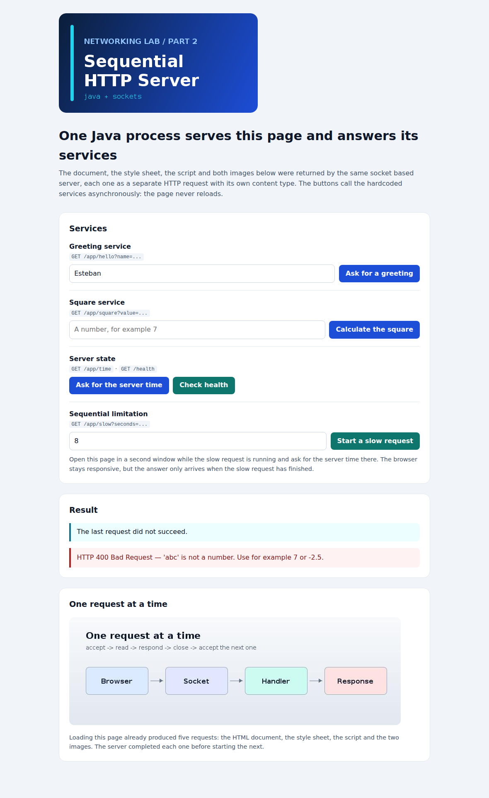

# Evidence and results

Every output on this page was produced by running the application locally with
`java -jar target/minimal-http-server.jar` on port `35000`. The screenshots were taken in a real
Chromium browser loading `http://localhost:35000/`.

The last section is reserved for the EC2 run, which has to be captured on the instance launched
with your own AWS learner account.

---

## 1. The page and its resources



Loading a single page produced five separate HTTP requests. The browser network view shows each
one with its own status and content type:

| Method | Path | Status | Content type | Length |
| --- | --- | --- | --- | --- |
| GET | `/` | 200 | `text/html; charset=UTF-8` | 3581 |
| GET | `/styles.css` | 200 | `text/css; charset=UTF-8` | 2737 |
| GET | `/app.js` | 200 | `text/javascript; charset=UTF-8` | 5305 |
| GET | `/images/logo.png` | 200 | `image/png` | 23196 |
| GET | `/images/request-flow.jpg` | 200 | `image/jpeg` | 15580 |
| GET | `/app/hello?name=Esteban` | 200 | `application/json; charset=UTF-8` | 68 |
| GET | `/app/square?value=abc` | 400 | `application/json; charset=UTF-8` | 61 |
| GET | `/app/time` | 200 | `application/json; charset=UTF-8` | 98 |

The raw capture is stored in [`img/network.json`](img/network.json).

The console of the server shows the same requests arriving one after another in a single process:

```text
Server listening on port 35000 - press Ctrl+C to stop
GET / HTTP/1.1 -> 200 text/html; charset=UTF-8 (3581 bytes)
GET /styles.css HTTP/1.1 -> 200 text/css; charset=UTF-8 (2737 bytes)
GET /app.js HTTP/1.1 -> 200 text/javascript; charset=UTF-8 (5305 bytes)
GET /images/logo.png HTTP/1.1 -> 200 image/png (23196 bytes)
GET /images/request-flow.jpg HTTP/1.1 -> 200 image/jpeg (15580 bytes)
```

---

## 2. Asynchronous requests without reloading the page

A greeting requested from the page: only the result area changed, the page was never reloaded.



The server time comes from the host, not from the browser clock:



---

## 3. Controlled errors

An invalid value reaches the server, is rejected with `400` and is shown to the user as a readable
message instead of a stack trace:



---

## 4. Protocol evidence

### GET / (home page)

```http
HTTP/1.1 200 OK
Date: Mon, 07 Sep 2026 23:06:04 GMT
Server: minimal-http-server/1.0
Content-Type: text/html; charset=UTF-8
Content-Length: 3581
Connection: close

<!DOCTYPE html>
```

### GET /images/logo.png (binary resource)

```http
HTTP/1.1 200 OK
Date: Mon, 07 Sep 2026 23:06:04 GMT
Server: minimal-http-server/1.0
Content-Type: image/png
Content-Length: 23196
Connection: close
```

### GET /app/hello?name=Ana%20Mar%C3%ADa (dynamic service)

```http
HTTP/1.1 200 OK
Date: Mon, 07 Sep 2026 23:06:04 GMT
Server: minimal-http-server/1.0
Content-Type: application/json; charset=UTF-8
Content-Length: 74
Connection: close

{"service":"greeting","name":"Ana María","greeting":"Hello, Ana María!"}
```

`Content-Length` is 74 for a body of 72 characters: the two accented letters occupy two bytes each,
which is exactly why the length is calculated from the bytes and not from the string.

### GET /app/square?value=abc (invalid input)

```http
HTTP/1.1 400 Bad Request
Content-Type: application/json; charset=UTF-8
Content-Length: 61
Connection: close

{"error":"'abc' is not a number. Use for example 7 or -2.5."}
```

### GET /missing.html (missing resource)

```http
HTTP/1.1 404 Not Found
Content-Type: text/html; charset=UTF-8
Content-Length: 456
Connection: close
```

### POST / (unsupported method)

```http
HTTP/1.1 405 Method Not Allowed
Content-Type: text/html; charset=UTF-8
Content-Length: 494
Allow: GET
Connection: close
```

### GET /../pom.xml (path traversal, sent verbatim with `curl --path-as-is`)

```http
HTTP/1.1 403 Forbidden
Content-Type: text/html; charset=UTF-8
Content-Length: 440
Connection: close
```

The project descriptor was not disclosed. The encoded variant
`/images/%2e%2e/%2e%2e/pom.xml` is refused in the same way, because the path is decoded before it
is normalised.

### A malformed request does not stop the server

```text
$ printf 'THIS IS NOT HTTP\r\n\r\n' | nc localhost 35000
HTTP/1.1 400 Bad Request
Content-Type: text/plain; charset=UTF-8
Content-Length: 54
Connection: close

Bad Request: Unexpected request line: THIS IS NOT HTTP
```

The next request is answered normally: the listening socket stayed open.

---

## 5. Functional test matrix (`scripts/smoke-test.sh`)

```text
Checking http://localhost:35000

Static resources
  ok    home page                    /                                      200 text/html; charset=UTF-8
  ok    style sheet                  /styles.css                            200 text/css; charset=UTF-8
  ok    client script                /app.js                                200 text/javascript; charset=UTF-8
  ok    PNG image                    /images/logo.png                       200 image/png
  ok    JPEG image                   /images/request-flow.jpg               200 image/jpeg

Hardcoded services
  ok    greeting                     /app/hello?name=Esteban                200 application/json; charset=UTF-8
  ok    square                       /app/square?value=7                    200 application/json; charset=UTF-8
  ok    server time                  /app/time                              200 application/json; charset=UTF-8
  ok    health                       /health                                200 application/json; charset=UTF-8

Controlled errors
  ok    greeting without name        /app/hello                             400 application/json; charset=UTF-8
  ok    square with a word           /app/square?value=abc                  400 application/json; charset=UTF-8
  ok    missing static file          /does-not-exist.html                   404 text/html; charset=UTF-8
  ok    unsupported method           /                                      405 text/html; charset=UTF-8
  ok    path traversal               /../pom.xml                            403 text/html; charset=UTF-8
  ok    encoded traversal            /images/%2e%2e/%2e%2e/pom.xml          403 text/html; charset=UTF-8

Repeated requests in one server run
  ok    ten consecutive requests succeeded

All checks passed.
```

Automated suite:

```text
$ mvn test
[INFO] Tests run: 6,  Failures: 0, Errors: 0, Skipped: 0 -- JsonTest
[INFO] Tests run: 6,  Failures: 0, Errors: 0, Skipped: 0 -- ResourcePathsTest
[INFO] Tests run: 6,  Failures: 0, Errors: 0, Skipped: 0 -- ServerConfigTest
[INFO] Tests run: 17, Failures: 0, Errors: 0, Skipped: 0 -- WebApplicationTest
[INFO] Tests run: 3,  Failures: 0, Errors: 0, Skipped: 0 -- MediaTypesTest
[INFO] Tests run: 9,  Failures: 0, Errors: 0, Skipped: 0 -- HttpServerIntegrationTest
[INFO] Tests run: 9,  Failures: 0, Errors: 0, Skipped: 0 -- HttpRequestTest
[INFO] Tests run: 56, Failures: 0, Errors: 0, Skipped: 0
[INFO] BUILD SUCCESS
```

---

## 6. The sequential limitation (section 6.2)

Prediction made before running the experiment: *the second user will see the page react
immediately, because the JavaScript client does not block, but the answer will only arrive after
the first request has finished, because the Java server reads one connection at a time.*

Measured with `scripts/observe-sequential-limitation.sh`:

```text
Observing the sequential limitation of http://localhost:35000
  slow request: /app/slow?seconds=6

  slow request   sent at   0.00s   finished at   6.02s   status 200
  fast request   sent at   0.51s   finished at   6.02s   status 200

The fast request was sent half a second after the slow one, but the server could only
start reading it once the slow response had been written: one connection at a time.
```

The fast request needed 5.5 s to be answered although the service it called takes a few
milliseconds. The prediction holds.

**Asynchronous client is not a concurrent server.** `fetch` releases the browser's main thread, so
the second window keeps painting, scrolling and accepting clicks. It does not give the Java process
a second execution path: the accept loop is still one thread that finishes one response before
reading the next connection.

---

## 7. Remote execution on AWS EC2

Deployment performed on 8 September 2026 on one `t3.micro` instance running Amazon Linux 2023 in
`us-east-1`, reachable at `ec2-34-207-78-128.compute-1.amazonaws.com:35000` while the laboratory
was running. The instance was terminated afterwards, so the address no longer resolves to anything.

### 7.1 The application running from EC2


The address bar shows the public DNS name of the instance and the application port. The page, its
style sheet, its script and both images were downloaded from the Java server running on EC2. The
browser marks the site as *Not secure* because the server speaks plain HTTP: TLS is explicitly out
of the scope of this laboratory.

### 7.2 The service running under systemd, verified from inside the instance


```console
[ec2-user@ip-172-31-26-120 ~]$ curl -s http://localhost:35000/health
{"status":"ok","uptimeSeconds":328}

[ec2-user@ip-172-31-26-120 ~]$ sudo journalctl -u minimal-http-server -n 15 --no-pager
Sep 08 00:24:18 ip-172-31-26-120.ec2.internal systemd[1]: Started minimal-http-server.service - Minimal HTTP server (networking lab, part 2).
Sep 08 00:24:18 ip-172-31-26-120.ec2.internal minimal-http-server[6423]: Server listening on port 35000 - press Ctrl+C to stop
Sep 08 00:24:20 ip-172-31-26-120.ec2.internal minimal-http-server[6423]: GET /health HTTP/1.1 -> 200 application/json; charset=UTF-8 (33 bytes)
Sep 08 00:29:47 ip-172-31-26-120.ec2.internal minimal-http-server[6423]: GET /health HTTP/1.1 -> 200 application/json; charset=UTF-8 (35 bytes)
```

Two facts worth reading carefully in that log:

- systemd started the unit and the application logged `Server listening on port 35000`, so the
  process is supervised by the operating system and not by an interactive shell;
- the two `GET /health` lines are five minutes apart, and the second one was answered **after the
  administration session had been closed**. That is the requirement of section 7.4: the application
  keeps running after logout.

### 7.3 The application answering from outside the instance

```console
PS C:\...\Minimal-HTTP-Server-to-a-Web-Application-on-AWS> curl.exe -i http://ec2-34-207-78-128.compute-1.amazonaws.com:35000/health
HTTP/1.1 200 OK
Date: Tue, 08 Sep 2026 00:31:44 GMT
Server: minimal-http-server/1.0
Content-Type: application/json; charset=UTF-8
Content-Length: 35
Connection: close

{"status":"ok","uptimeSeconds":446}
```

The same response that was produced on the loopback interface of the instance now crosses the
Internet, the security group and the public interface, unchanged.

### 7.4 The instance


One instance, type `t3.micro`, state *Running*, with an auto-assigned public IPv4 address and no
Elastic IP. Exactly one host: no load balancer, no scaling group, no second instance.

### 7.5 The security group


| Direction | Port | Purpose |
| --- | --- | --- |
| Inbound | 22 (SSH) | administration of the instance |
| Inbound | 35000 | the application |
| Outbound | all | installing the Java runtime |

Exactly two ports are reachable from outside: the administration port and the application port. An
inbound rule for port 443 existed at first and was removed once it was clear that nothing listens
there — the application speaks plain HTTP on 35000, so the rule only widened the exposed surface.

The guide also recommends narrowing the SSH rule to the student's own public address; that
narrowing was not applied during this short classroom run.

---

## 8. Mandatory cleanup


```text
Successfully initiated termination (deletion) of i-074faaf18883560bb
Instance state: Shutting-down
```

The single instance of the laboratory was terminated once the evidence had been collected, so it
stops generating charges. No Elastic IP was allocated, and the security group was left with only
the two rules described above before being removed.

From this moment on `ec2-34-207-78-128.compute-1.amazonaws.com` no longer resolves to a running
host: the remote evidence of this page is what documents that deployment.

---

## 9. Evidence not captured

The browser network view, the asynchronous call, the controlled error and the timeline of the
sequential limitation were captured against the **local** server (sections 1 to 6) but not against
the EC2 deployment, because the instance was terminated first. What documents the remote run is the
home page loaded from the public address, the health service answered both from inside the instance
and from the developer machine, and the systemd journal.
